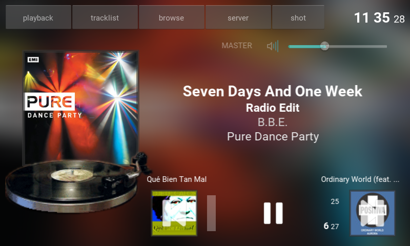
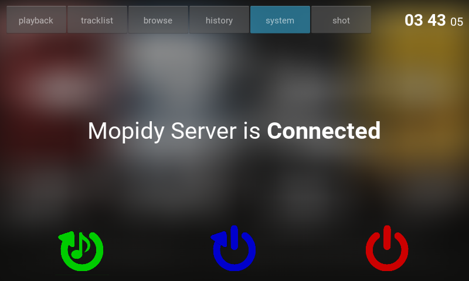

Rockberry-Player
================

Music Player user interface for the RaspberryPI.

It is based on two killer projects written in Python:
 - [Mopidy](https://www.mopidy.com): extensible music server with Spotify
 - [Kivy](https://kivy.org): graphical interface framework for touch devices

It conforms the screen interface for a personal music device (Rockberry)

Screenshots
-----------

