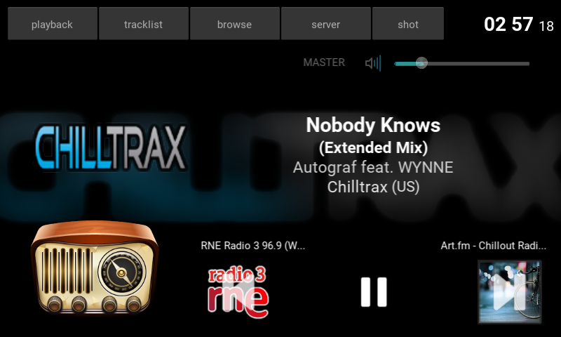
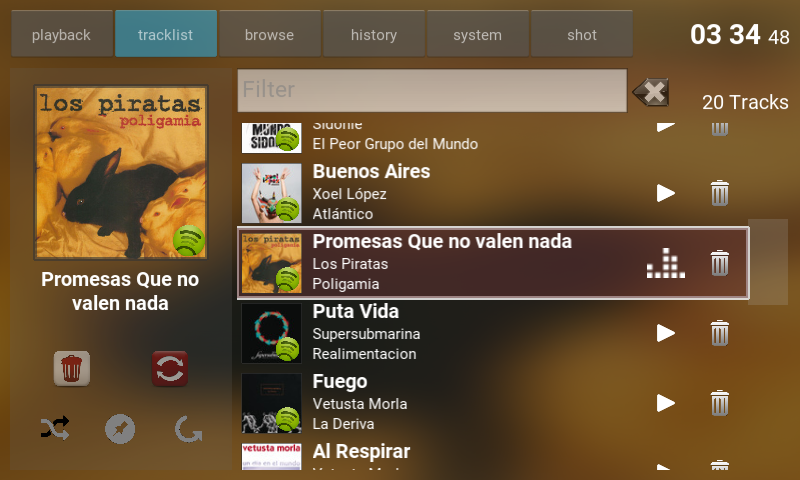

****************************
Rockberry-Player
****************************

Music Player user interface for the RaspberryPI.

It is based on two killer projects written in Python:
 - [Mopidy](https://www.mopidy.com): extensible music server with Spotify
 - [Kivy](https://kivy.org): graphical interface framework for touch devices

It conforms the screen interface for a personal music device (Rockberry)

Screenshots
===========

Changelog
=========

* v0.1.2 (UNRELEASED)
    - Browse screen (first approach)
    - Screenshots

* v0.1.0 (UNRELEASED)
    - Initial release on GitHub
